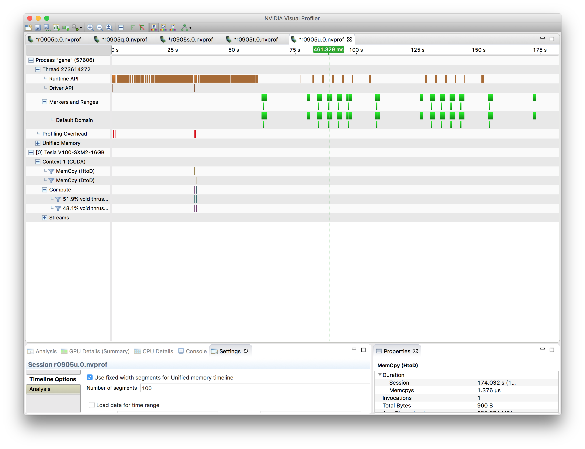
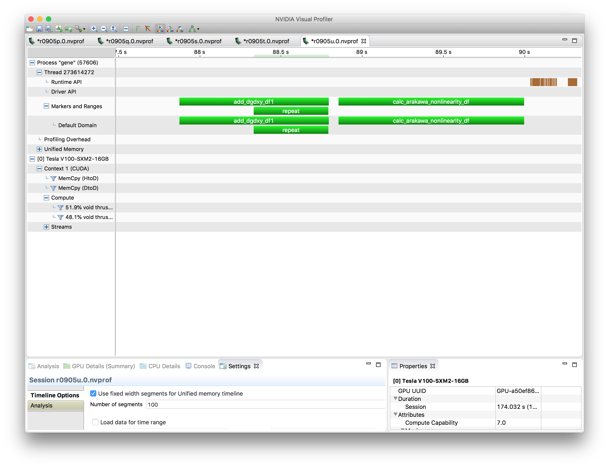
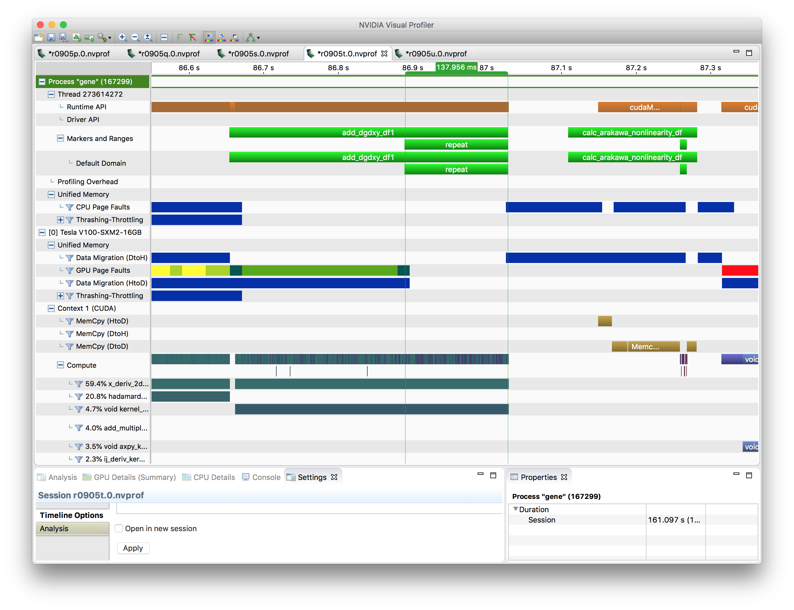
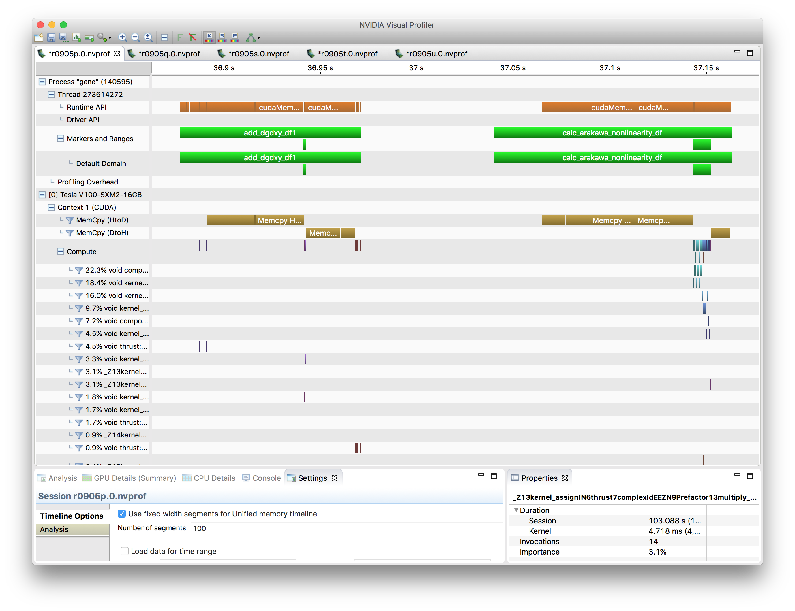
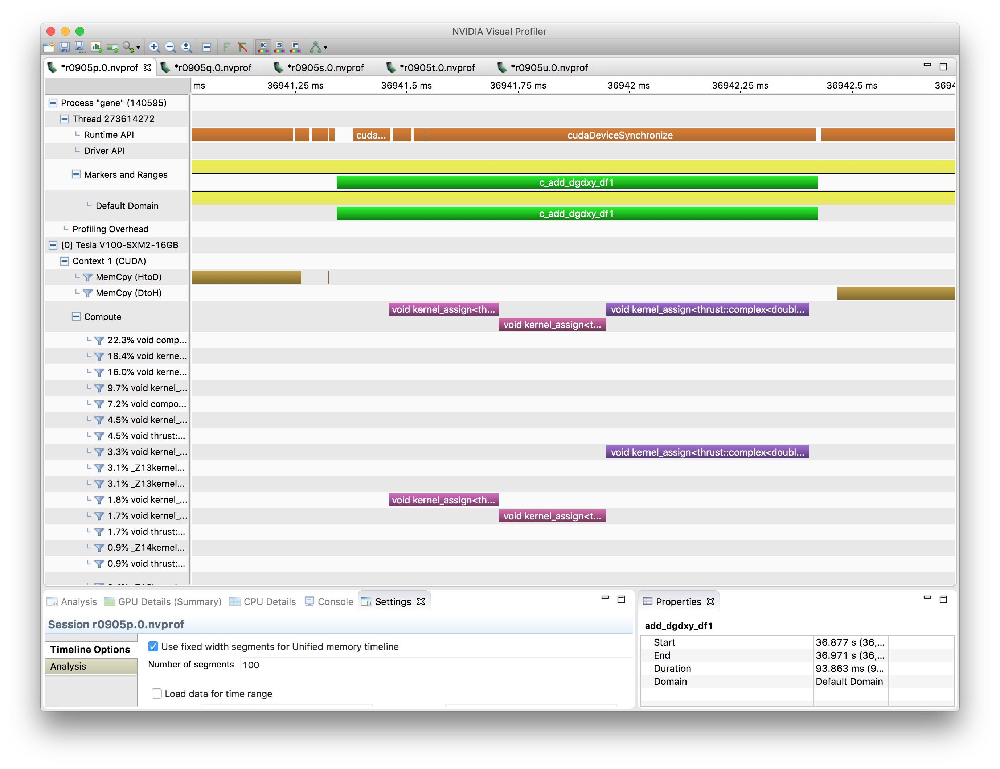
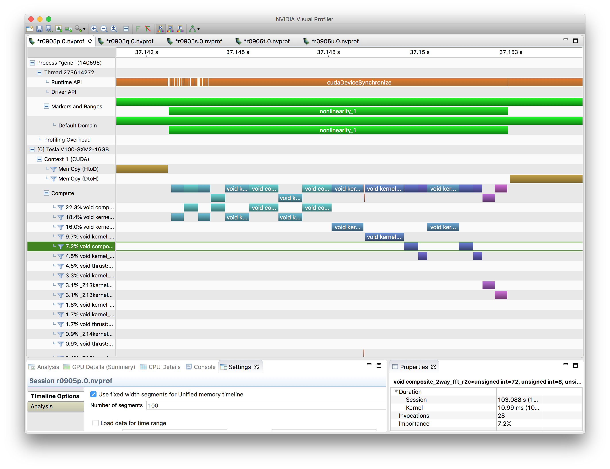

Case Study: Small Kernels vs Large Kernels
==========================================

Caveats
-------

* This is an arbitrary case that I picked pretty much randomly. Smaller / larger cases will behave differently, but the trends should be similar (I haven't tried).
* The subroutines I focused on (``add_dgdxy_df1`` and ``calc_arakawa_nonlinearity_df``) are rather straightforward to port. Not everything's going to be this easy, and work that well.
* The port assumes the simplest case, that is ``nprocs_x = 1`` and ``nprocs_y = 1``. Other cases are doable, but more work, and having to communicate is not likely going to be good for performance.
* The case is run on 4 MPI procs / 4 GPUs on Summit. I'll divide the CPU timing by 7 to account for the 7:1 CPU core / GPU ratio.

Parameters
----------
  
The parameters I'musing are based on the big-8 test case. I set a fixed decomposition only in z, ``nprocs_z = 4``. I set ``istep_energy = 1`` to help with verifying that I'm not breaking things. ``perf_vec  =  1 1 1 1 1 1 1 1 1``. I commented out ``arakawa_zv`` and ``arakawa_zv_order``, I don't remember why. I ran for only two timesteps. Problem size::

   &box
   n_spec =    2
   nx0    =  120
   nky0   =   24
   nz0    =   16
   nv0    =   32
   nw0    =    8

Overview
--------

Basically, I'm comparing three versions, (a) CPU to (b) existing GPU kernels to (c) merged larger GPU kernels. You can just skip to the summary if you don't care about the details. In reality, I obtained these results kinda backwards, ie., once I had the big kernels working, I went back to the original small kernels, and to disabling the GPU (mostly) altogether. I used ``nvprof`` to collect all the data shown.

CPU Version
-----------

The timeline for the entire run shows the expected structure: Start-up and initialization, and then 2 timesteps with 4 RK stages each. There's a 5th repeat of the kernel calls, maybe because of the diagnostics I turned on -- I haven't bother to look into this.

Zooming into (part of) one RK stage, one can see the two regions I annotated with ``nvtx``. The first one, ``add_dgdxy_df1`` actually is repeated twice (I added a loop, the reason will become clear soon.) In this case the ``repeat`` is half of the total time, as one would expect. I only use timing for the ``repeat`` part, and so get:

.. list-table::
   :header-rows: 1

   * - Version
     - add_dgdxy_df1
     - calc_arakawa_nonlinear_df
   * - CPU
     - 66 ms = 461 ms / 7
     - 163 ms = 1143 ms / 7
  

GPU Small Kernels
-----------------

The nonlinearity calculation didn't have existing kernels that had already been ported to the GPU, so I'll just show my complete (large kernel) GPU version. But ``add_dgdxy_df1`` basically consists of three steps, which are repeated for every x-y slice: Calculating x derivatives, calculating y derivatives, updating the r.h.s. using those derivatives. Two kernels already existed, that is for the 1st and the 3rd step. With the y derivative on the GPU, data would have to move between CPU and GPU all the time, which definitely kills performance, so I implemented a y derivative kernel on the GPU.

In order to be able to look at the performance of the actual computation, I needed to avoid memory migration from host to device memory a the same time. Since ``cudaMemPrefetchAsync`` followed by a ``cudaDeviceSynchronize`` for whatever reason didn't migrate the memory completely, I ended up just repeating the operation twice. The 2nd time around, no more migrations happen, the data is already resident in the GPU memory. This can be seen by the absence of page faults for the ``repeat`` stage.

The small kernel based ``add_dfdxy_df`` ends up being slower on the GPU compared to (extrapolated) 7 CPU cores, even after excluding the time required for transferring memory between host and device.

.. list-table:: 
   :header-rows: 1

   * - Version
     - add_dgdxy_df1
     - calc_arakawa_nonlinear_df
   * - CPU
     - 66 ms = 461 ms / 7
     - 163 ms = 1143 ms / 7
   * - small kernel GPU
     - 139 ms (kernels only)
     - 9 ms (kernels only); 173 ms (total)

GPU Large Kernels
-----------------

Finally, I went and made the 3 kernels that comprise ``add_dgdxyz_df1`` work on an entire "block" of data at once, and I'm using just one block per MPI process. I did this work with explicitly allocated device memory and copying data back and forth explicitly.

I can now also measure the timing for just the three kernel invocations in ``add_dgdxyz_df1``, to get just the compute time excl. of memory transfer:

For the record, here's the same kind of zoom into what happens in the nonlinearity calculation.

What's particularly noteworthy is that the time for just the computation of ``add_dgdxy_df1`` went from 173 ms to 1 ms, by changing from slice-based to block-based kernels.
	   
.. list-table:: 
   :header-rows: 1

   * - Version
     - add_dgdxy_df1
     - calc_arakawa_nonlinear_df
   * - CPU
     - 66 ms = 461 ms / 7
     - 163 ms = 1143 ms / 7
   * - small kernel GPU
     - 139 ms (kernels only)
     - 9 ms (kernels only); 173 ms (total)
   * - large-kernel GPU
     - 1 ms (kernels only); 93 ms (total)
     - 9 ms (kernels only): 123 ms (total)

Summary
-------

The table above basically tells the story. Going from 7 CPU cores to 1 GPU, the actual computation gets faster by a factor of 66x and 18x for ``add_dgdxy_df1`` and ``calc_arakawa_nonlinearity_df``, respectively, which are excellent numbers, even though no actual tuning of kernels was done. The difference in compute performance between small and large kernels (139 ms -> 1 ms) is enormous in this case. This might be less pronounced in a case that has much larger x-y slices, though.

Not surprisingly, in absolute terms, the memory transfers are stil killing the performance. The conclusion from that is what we already know: Ideally the entire timestep calculation should happen on the GPU eventually, to eliminate the host-device memory traffic (or at least greatly reduce it).

