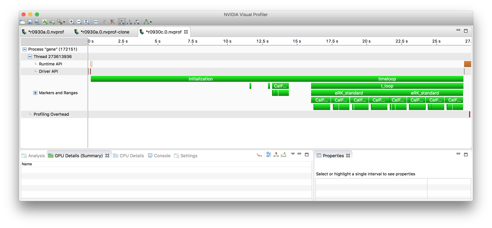
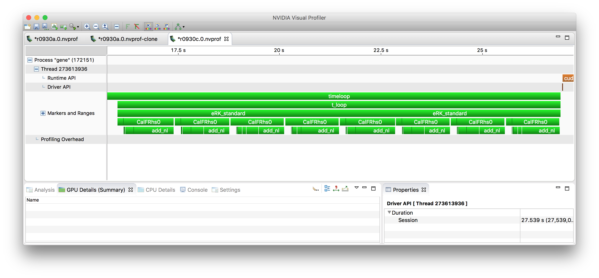
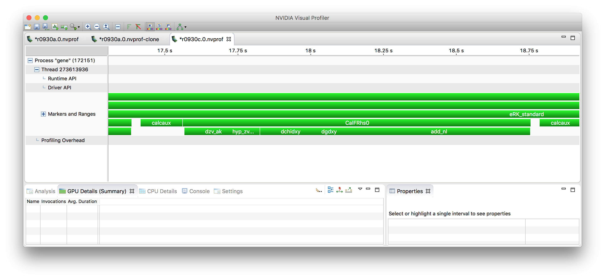
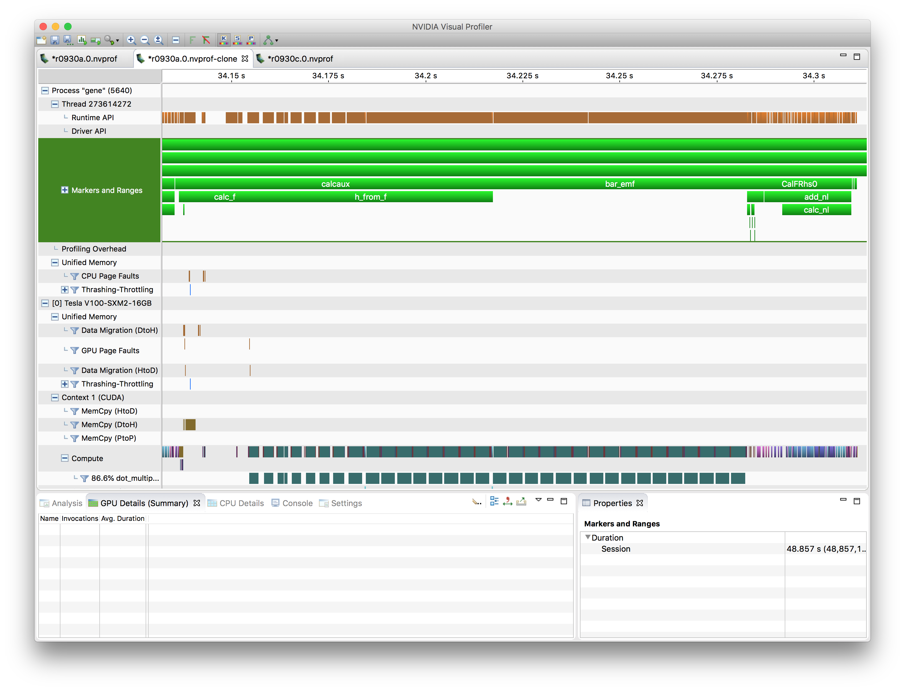

GENE Code Performance Overview
==============================

Caveats
-------

* The following is based on the big-8 test case, with some
  modifcations. I believe what it shows is essentially typical
  behavior, but YMMV.
* I'm myself rather new to GENE, so I may have missed some things or
  gotten something wrong.
* I had some issue with the profiling of the CPU-only version, so the
  profile is not as detailed as it could be, but the important things
  are there.

Big picture
-----------

Most of the profiling I'm showing in the following is from a benchmark
run on Summit that just used 4 CPU cores. The code is MPI
parallelized. The profile on all procs should essentially looks the
same, with maybe some minor imbalance at times due to physical
boundary conditions.

At the top level, you see two phases, ``initialization`` and
``timeloop``. Since the initialization happens only once, its
performance can be mostly ignored. The ``timeloop`` in this example
is very short (only two time steps), but in real life wll be composed
of a very large number of steps.

There can also be a phase 0, the autotuning. It is turned off in this
run. That phase will determine parameters to get optimal performance,
by

* evaluating different options for domain decomposition across the
  given number of MPI processes

* find an optimal parameter for cache blocking

* evaluate variants of various kernels which do the same operation but
  are implemented in some variations

As a general overview, the GENE code integrates 6-dimensional
distribution functions in time, together with supporting
lower-dimensional quantities like the electromagnetic
field. Distribution functions are discretized in space (x, y, z),
velocity space (v, w) and by species, The code often considers the
distribution function arrays in a reshaped fashion, where it becomes
f(i, j, klmn), ie. many i-j (x-y) slices, where klmn collapses
the remaining 4 dims (k, l, m, n). This is what the cache blocking
is based on. If ``nblocks == 1``, all nk * nl * nm * nn
slices are processed together. However, if ``nblocks > 1``, nk *
nl * nm * nn is subdivided into as many equal-sized pieces
("blocks"). Then, all operations are performed for just the first block,
next all operations are performed on the second block, etc. In order
to have a large amount of parallelism available for offloading onto
the GPU, it is helpful to have large blocks, so in my work I have been
using ``nblocks = 1``, which for the test I've been using gives me a
per-MPI process index space of 120 x 24 x 32 x 8 x 2 complex
quanities, which is giving me pretty good results in terms of GPU
performance already, but production runs are going to have yet larger
problem sizes.

Timeloop
--------

Zooming into the timeloop, once can see the general structure of time
integration.

	   
As stated above, in this benchmark case, the timeloop is only run
for two steps, which show up as ``eRK_standard``. Each timestep is
performed by a 4th order Runge-Kutta (RK) method. which is comprised of
4 essentially identical stages. At each stage, the r.h.s. is
calculated and then used to update some temporary fields, which
eventually are combined into the new solution at time n+1.

In a real run, additionally, diagnostics will happen every so many
time steps -- this is ignored here.

RK stage
--------

Each RK stage consists of some prep work (``calcaux``) and then the
computation of the r.h.s. (which is also a 6-d array, like the
distribution functions) (''CalFRhs0''). At the end of the stage there
are some updates of the temporary arrays, which is missing a marker in
this profile, it's in the white space after ``CalFRhs0``.

Computation of the r.h.s.
-------------------------

In the profile above, one can also see the steps involved in
calculating the r.h.s. -- essentially, terms from the physical
equations are added up one after the other. These involve z and v
derivatives (``dzv_ak``), hyperdiffusion (``hyp_zv``), various terms
involving x and y derivatives (``dfdxy`` (doesn't show up separately),
``dchidxy``, ``dgdxy``), and then finally the nonlinear terms
(``add_nl``).

One can see that while ``CalcFRhs0`` if taken inclusively is where the
majority of time is spent, it calls a number of other functions each
of which take somewhat comparable amounts of time, so there is no one
function that dominates the overall behavior.

The call chain doesn't end here, functions like ``dchidxy`` are often
further subdivided into a few actual computational kernels (typically
I'd say about two or so).

The actual kernels are for the most part stencil computations --
to show an example of a pretty large one:

.. code-block:: Fortran

       do concurrent(n=bl(6):bu(6),&
         m=bl(5):bu(5), l=bl(4):bu(4), &
         k=bl(3):bu(3), j=bl(2):bu(2) )
       b(i1:i2,j,k,l,m,n) = &
            sten(i1:i2, 1,k,l,m,n)*a(i1:i2,j,k  ,l-2,m,n) + &
            sten(i1:i2, 2,k,l,m,n)*a(i1:i2,j,k-1,l-1,m,n) + &
            sten(i1:i2, 3,k,l,m,n)*a(i1:i2,j,k  ,l-1,m,n) + &
            sten(i1:i2, 4,k,l,m,n)*a(i1:i2,j,k+1,l-1,m,n) + &
            sten(i1:i2, 5,k,l,m,n)*a(i1:i2,j,k-2,l  ,m,n) + &
            sten(i1:i2, 6,k,l,m,n)*a(i1:i2,j,k-1,l  ,m,n) + &
            sten(i1:i2, 7,k,l,m,n)*a(i1:i2,j,k  ,l  ,m,n) + &
            sten(i1:i2, 8,k,l,m,n)*a(i1:i2,j,k+1,l  ,m,n) + &
            sten(i1:i2, 9,k,l,m,n)*a(i1:i2,j,k+2,l  ,m,n) + &
            sten(i1:i2,10,k,l,m,n)*a(i1:i2,j,k-1,l+1,m,n) + &
            sten(i1:i2,11,k,l,m,n)*a(i1:i2,j,k  ,l+1,m,n) + &
            sten(i1:i2,12,k,l,m,n)*a(i1:i2,j,k+1,l+1,m,n) + &
            sten(i1:i2,13,k,l,m,n)*a(i1:i2,j,k  ,l+2,m,n)
        end do

The nonlinearity calculation is a bit different in that it involves
FFTs into real space, then a number of stencil computations, then FFTs
back. It consists of more kernels (maybe ~8) than the remaining terms,
and the FFTs, so that's why it shows up as slower.

The nonlinearity calculation as-is in Fortran is not well suited for
offloading because it currently is written as slice-by-slice
processing, rather than whole blocks, so the available parallelism is
too small. (I have rewritten it by block for the CUDA work, but that's
in C++ -- it wouldn't be difficult to do this in Fortran, too,
though.)

All the other stencil computations I think are decent candidates for
offloading, they're probably memory bound but can still can get pretty
nice speed-ups.

There are some additional operations not covered in the above, for example the
field solve (sparse linear algebra), and gyro-averaging (also linear
algebra), but the vast majority of time is spent in various forms of
stencil computations.

Current GPU work
----------------

So in order to make my point that off-loading works, let me show the
current state of the GPU port using CUDA:

This profile also shows a single RK stage, ie., ``calcaux``, ``bar_emf``,
and ``CalFRhs0``. (``bar_emf`` didn't show up above since it's pretty
fast compared to its surrounding ``calcaux`` and ``bar_emf``).

``CalFRhs0`` has been the focus of my work, and it's vastly
faster. It's still comprised of the same underlying terms (too small
to be labeled) and then the nonlinarity part. The nonlinearity part
now takes a larger fraction of the r.h.s. calculation, but
essentially, the picture is similar.

What's different is that the intial part of the RK stage now takes a
relatively larger fraction of time -- the reason for this, I believe,
is that the gyroaveraging, while on the GPU, calls way too many small
kernels, so some refactoring into bigger kernels is needed there.

In terms of just looking at ``CalcFRhs0`` itself, the timing went from
1.19 s (1 CPU core) to 27 ms (1 V100 GPU). This is of course an unfair
comparison, but extrapolating given that Summit has 7 CPU cores / GPU,
it's a speed-up of 6.3x, which is at least a good start.

